# LED-Matrix-Clock

This [Link-Technologies.de](http://link-tech.de) project is about a simple ESP8266 driven clock.
Ok, another clock you ask, what is the purpose and what makes it special?

Well, as I am shortsighted and as I am sleeping without my glasses, I needed to have a clock on my nightstand, which is not too big, but big enough to be read without glasses in the night. It also has to be readable, but not too bright to disturb. It has to be exact and probably also slightly smart - and so I decided to create my own.

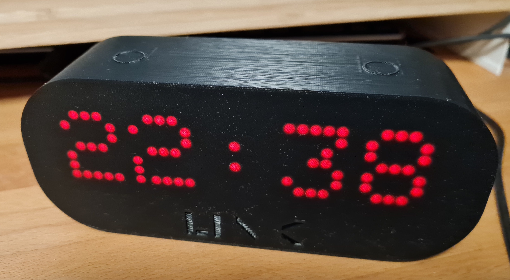

This project describes a smart **LED-Matrix Clock**, which is readable without glasses in the night including some smart touch buttons and a temp/humidity sensor.

**This clock is able to...**

- show local time in big letters
- grab exact current time from internet
- change brightness
- be turned off aka fully dimmed (if being to bright)
- can be turned on again - permanently or only on demand
- connects to the (local) MQTT server
- has two touch buttons and posts the actions to the MQTT server aka broker
- subscribes to a topic of an outside temperature
- can show outside temperature on a touch
- has build in sensor to measure rooms local temperature and humidity (to provide via MQTT)
- can show sliding messages to transmit information (sent via MQTT)
- can show blinking alarm messages requiring attention (sent via MQTT)

## Technical Components

This clock is made of/implements...

- an ESP8266 (as WeMos D1 Mini) as core CPU
- four chained LED matrix (8x8) elements up to a visible 8x32 LED-Matrix
- a SHT21 for local temperature and humidity measurement
- two touch buttons (one dedicated and one multipurpose)
- Self designed black case (PLA) to dimm the brightness and hold it all together

## MQTT

After a successful start up and an active WiFi connection, the clock connects to the MQTT broker and sends some global health and info data.
The status is sent "retained" and can be used to determine, if the device is still there or has lost the connection to the broker (last will).

### Topics sent

Examples:

- 'zuhause/haus/schlafzimmer/iotdevice-clock/AndreasClockDevice/status': 'online'
- 'zuhause/haus/schlafzimmer/iotdevice-clock/AndreasClockDevice/clientid': 'IoTDevice-42AFFE'
- 'zuhause/haus/schlafzimmer/iotdevice-clock/AndreasClockDevice/devicename': 'iotdevice-clock'
- 'zuhause/haus/schlafzimmer/iotdevice-clock/AndreasClockDevice/version': '0.3'
- 'zuhause/haus/schlafzimmer/iotdevice-clock/AndreasClockDevice/ssid': ''IoT-Hausbus''
- 'zuhause/haus/schlafzimmer/iotdevice-clock/AndreasClockDevice/ip': '192.168.123.181'
- 'zuhause/haus/schlafzimmer/iotdevice-clock/AndreasClockDevice/mac': '50:02:91:42:AF:FE'
- 'zuhause/haus/schlafzimmer/iotdevice-clock/AndreasClockDevice/voltage': '3.089'
- 'zuhause/haus/schlafzimmer/iotdevice-clock/AndreasClockDevice/temperature': '20.1'
- 'zuhause/haus/schlafzimmer/iotdevice-clock/AndreasClockDevice/humidity': '41'

### Buttons

If the buttons are pressed, each pressing aka touching event is also sent via MQTT.
Some example events are:

- Button 1 clicked/touched:
  - 'zuhause/haus/schlafzimmer/iotdevice-clock/AndreasClockDevice/button1/touched': '1'
    - Typically to either show the outside temperature once
    - Or if display is turned off, show the time for some seconds
- Button 1 long pressed:
  - 'zuhause/haus/schlafzimmer/iotdevice-clock/AndreasClockDevice/button1/long': '1'
  - Turning LED Matrix off... good night!
  - If display is off, turn it on again
- Button 2 clicked/touched:
  - 'zuhause/haus/schlafzimmer/iotdevice-clock/AndreasClockDevice/button2/touched': '1'
  - Free event to implement/use in homeautomation system, e.g. turn on a night lamp
- Button 2 double clicked/touched:
  - 'zuhause/haus/schlafzimmer/iotdevice-clock/AndreasClockDevice/button2/doubletouched': '1'
  - Free event to implement/use in homeautomation system, e.g. turn on lights
- Button 2 long pressed:
  - 'zuhause/haus/schlafzimmer/iotdevice-clock/AndreasClockDevice/button2/long': '1'
  - Free event to implement/use in homeautomation system, e.g. open the blinds
  
 **Remind:**
 If Button 1 is pushed during boot, it will force the WiFi Manager to start up, so setup can be changed!

### Subscriptions and Commands

After reboot and successful connection to the MQTT broker the clock subscribes to the following topics (examples are according to initial setup via WiFi Manager).

**Subscribing to MQTT topics...**

- zuhause/garten/kinderhaus/aussen/temperatur
  - Last provided value is scrolled once when button 1 is pushed/touched
  - If no value is there, nothing happens
- zuhause/haus/schlafzimmer/iotdevice-clock/AndreasClockDevice/command/**reboot**
  - If value is 1, the clock is rebooted
- zuhause/haus/schlafzimmer/iotdevice-clock/AndreasClockDevice/command/**led**
  - If value is 1, the LED on the ESP8266 is turned on
  - If value is 0, the LED on the ESP8266 is turned off
  - If value is 2, the LED on the ESP8266 is toggled
  - Info: This function was implemented for testing and development purposes and does not give any real value.
- zuhause/haus/schlafzimmer/iotdevice-clock/AndreasClockDevice/command/**deletewificonfig**
  - Deletes the WiFi config and forces the WiFi Manager to kick in with the reboot
  - Triggers a reboot
- zuhause/haus/schlafzimmer/iotdevice-clock/AndreasClockDevice/command/**factoryreset**
  - Well, all is gone as the SPIFFS is fully wiped
- zuhause/haus/schlafzimmer/iotdevice-clock/AndreasClockDevice/command/**showmessage**
  - Scrolls the given text two times over the matrix
  - Can be used to transmit urgent short messages, e.g. by the home automation system
- zuhause/haus/schlafzimmer/iotdevice-clock/AndreasClockDevice/command/**showtext**
  - Shows a text with max. 5 chars flashing on highest brightness
  - Message is blinking a few times and then disappears again
  - Can be used to send e.g. 'ALARM' or any other <=5 char word
- zuhause/haus/schlafzimmer/iotdevice-clock/AndreasClockDevice/command/**setledmatrixstatus**
  - If value is 1, the LED matrix is turned on
  - If value is 0, the LED matrix is turned off
  - It can be used to automatically turn a display on and off triggered by a home automation system, such it is off in the nights (if someone is sensitive) or if no one is a home
  - Value is also set/influenced/changed when holding button 1
- zuhause/haus/schlafzimmer/iotdevice-clock/AndreasClockDevice/command/**setledmatrixbrightness**
  - Sets the brightness between 1 and 15

## Case

The case is 3D printed and the STLs are also available. Please find the main case [here](./case/Clock-MainCase_LED-Matrix-ESP8266_v1.stl). A first version of the back lid is added [here](./case/Clock-BackLid_LED-Matrix-ESP8266_v1.stl) as well, but I am still working on this one (as I forgot a holder and hole for the SHT21 sensor \*facepalm\*).

I have printed my case with common cheap black PLA on an Prusa MK3S and it is the first print shown on the pictures here. My print time was at around 5h to 6h.
The back lid is screwed on the case by melting some M3 nuts into the holes before. I like things screwed and no clips, which can break :-).

**Remind:** I recommand using plain _black PLA_ (or maybe PETG) to get the best effect of the LED matrix display shining though the front. I tried with white, but this was too bright for me.

### Outstanding todos

- Optimze the clips at the touch sensors --> Make them slightly thinner
- Slightly widen the USB Port hole
- Upload finished back lid and add corresponding pictures
- Add a sensor hole to the back lid

----------

## Pictures

See following some more pictures:

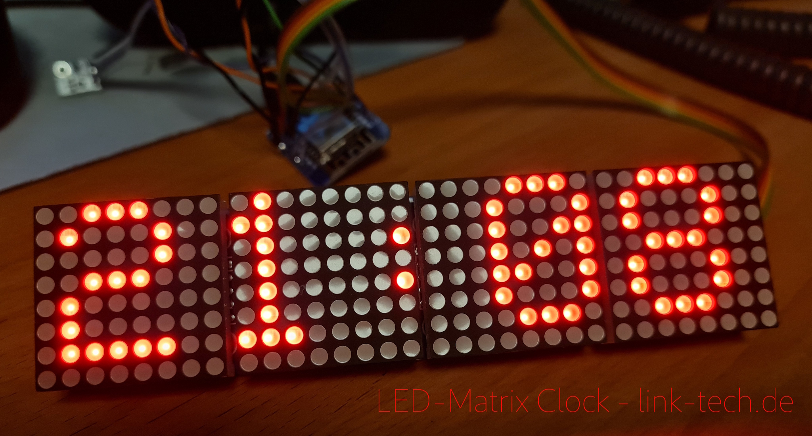

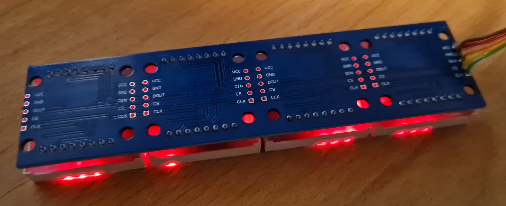

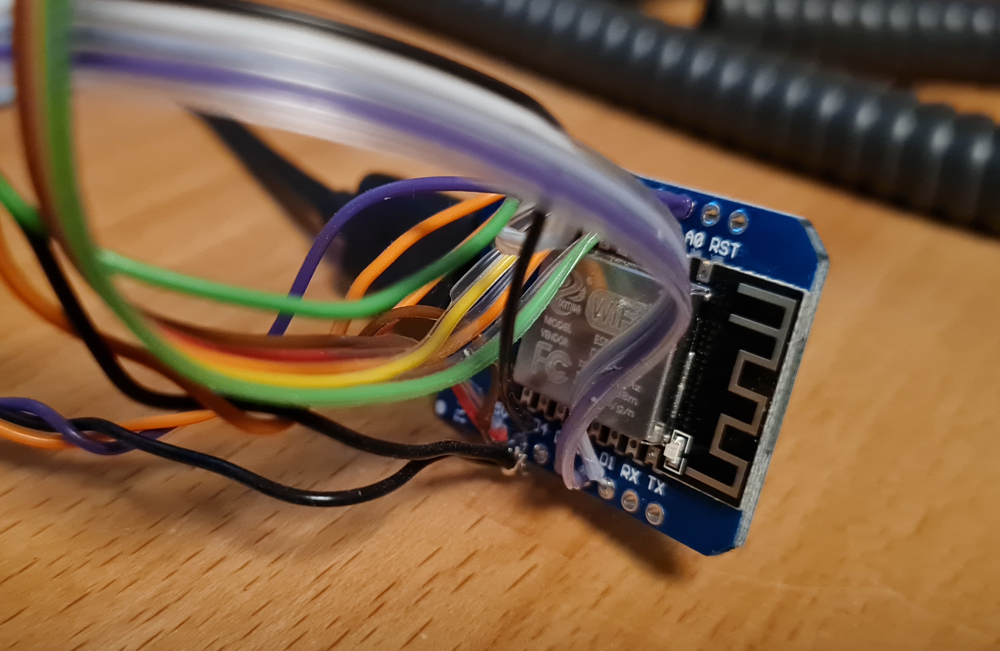

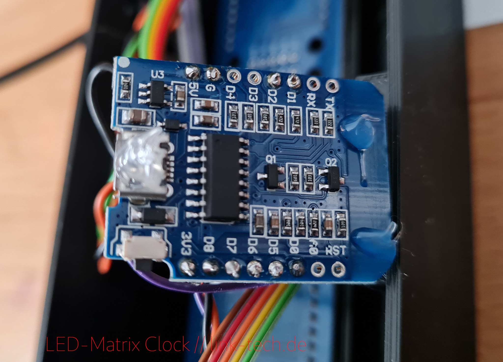

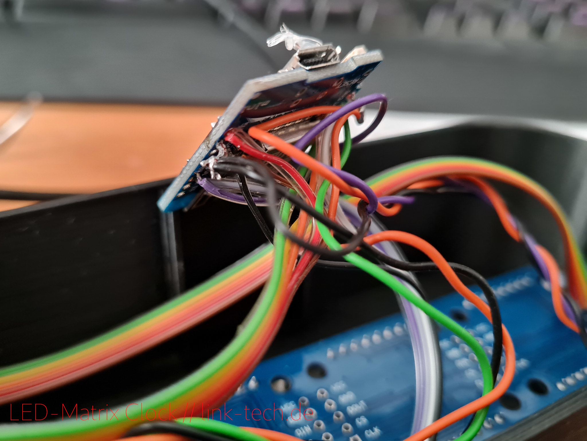

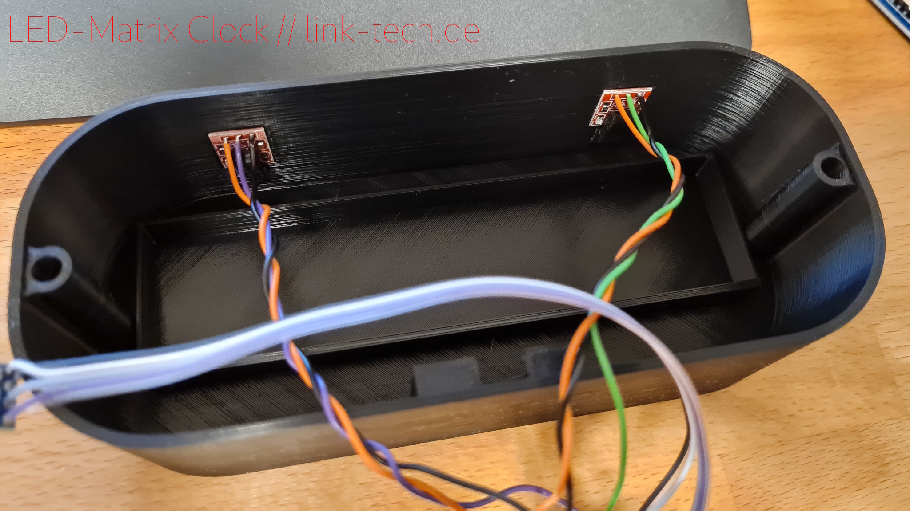

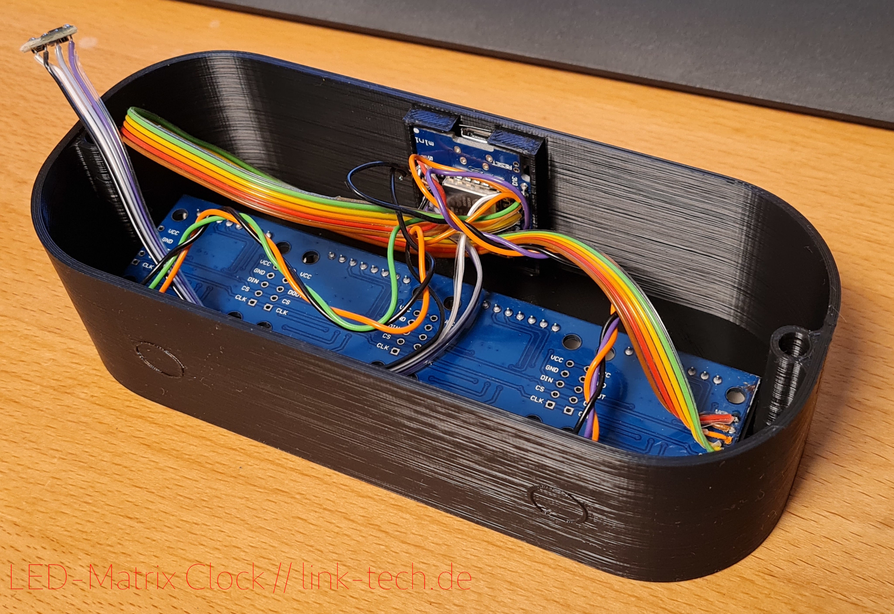

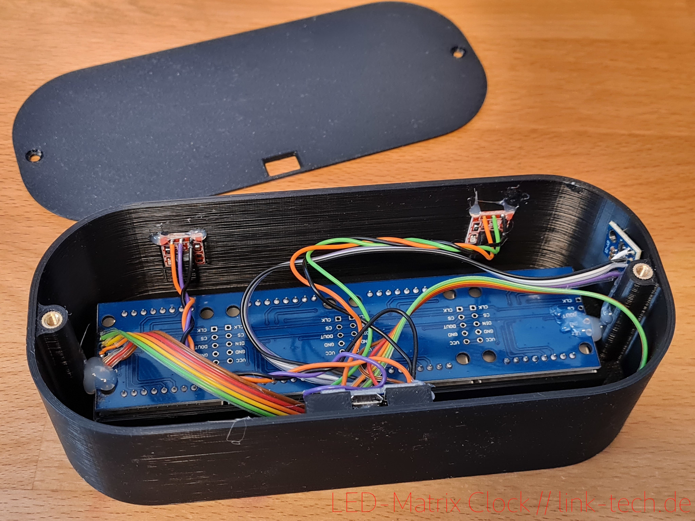

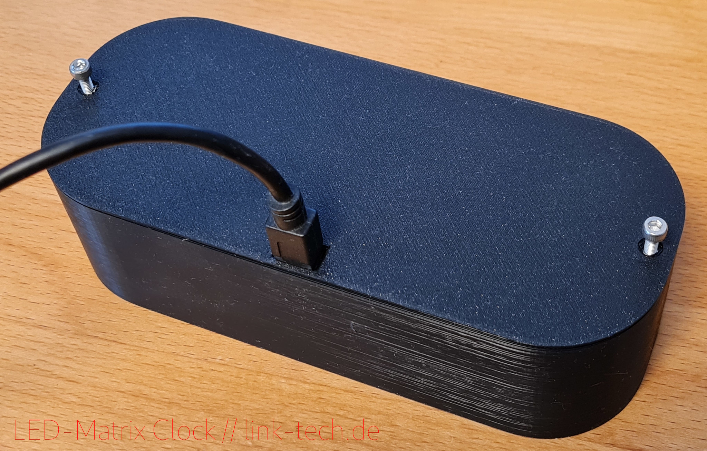

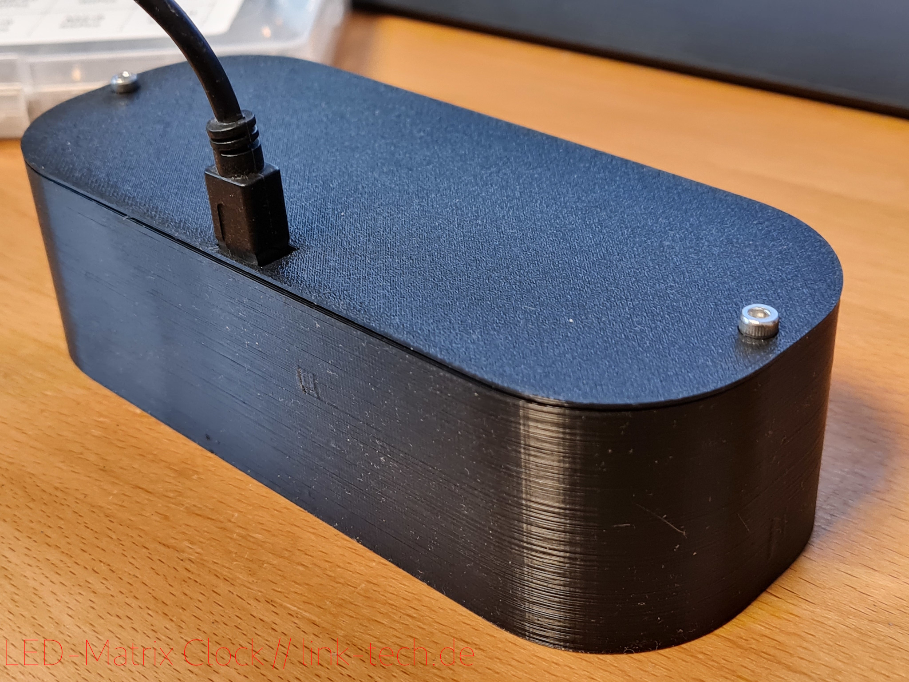

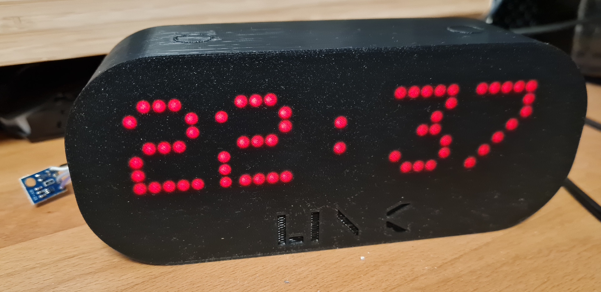

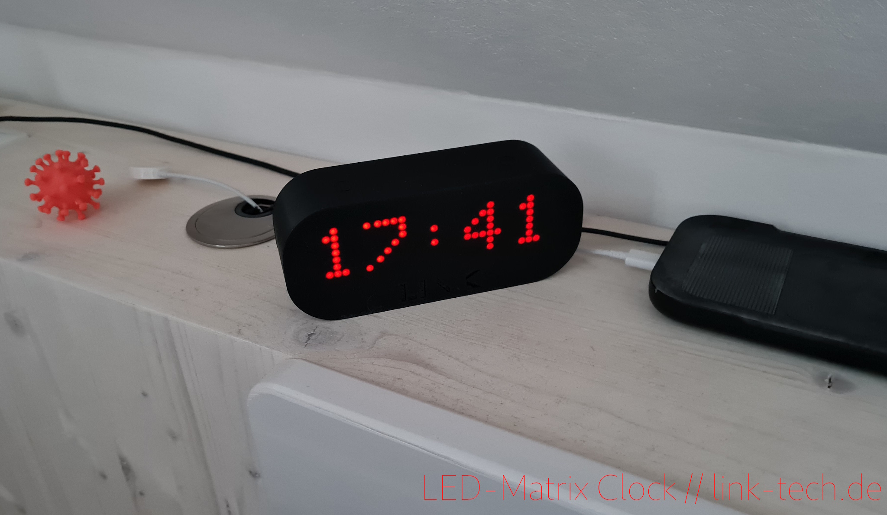
